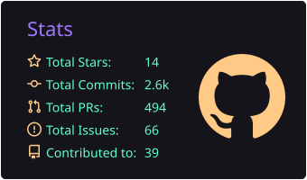

  

## Projects

  
  <h3><a href="https://github.com/itsmeares/staaash">Staaash ↗</a></h3>
  A self-hosted alternative to Google Drive.
   

  
  <h3>
    <a href="https://github.com/itsmeares/vanish">Vanish ↗</a>&nbsp;
    
  </h3>
  A local-first tool for reviewing and cleaning up your social media footprint. 🚧
   

## Technologies

### Languages & Web

  

### Data

  

### Infrastructure

  

### Tools

  

### Operating Systems

  

---

---

  

<picture>
  <source
    media="(prefers-color-scheme: dark)"
    srcset="https://raw.githubusercontent.com/itsmeares/itsmeares/output/github-snake-dark.svg"
  />
  <source
    media="(prefers-color-scheme: light)"
    srcset="https://raw.githubusercontent.com/itsmeares/itsmeares/output/github-snake.svg"
  />
  
</picture>
