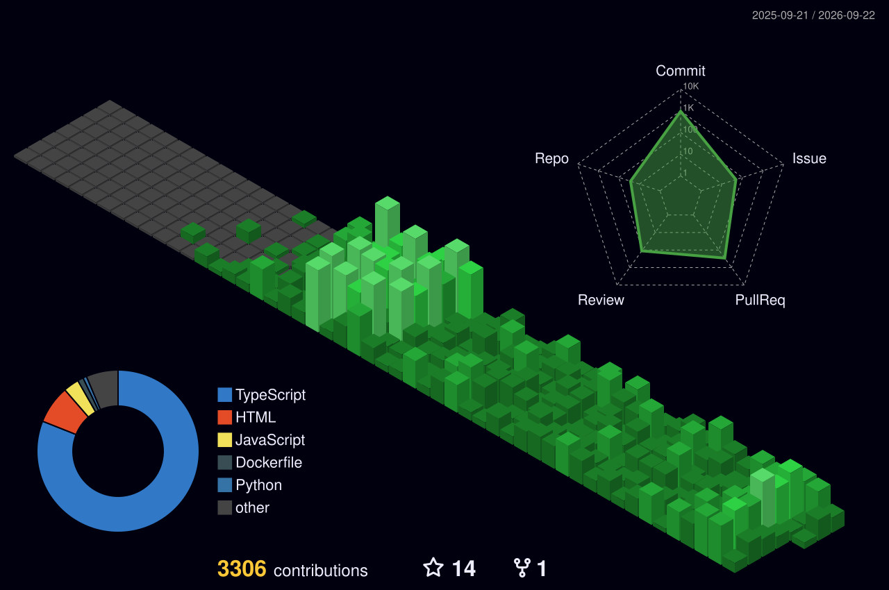

  <h1>Hi there, I'm Aras! </h1>
  <h3>Front End Developer</h3>
  

    Crafting digital experiences with a focus on aesthetics and performance.
  

  

    
    
    
  

---

### 🧐 About Me

- 🌍 I'm based in **London, UK**.
- 🚀 I'm currently building **[Graphon](https://github.com/itsmeares/Graphon)**.
- 🧠 I'm currently learning **TypeScript** and **Electron** deep dives.
- 🤝 I'm open to collaborating!

---

### 🚀 Current Project

> **[Graphon](https://github.com/itsmeares/Graphon)** — *The Next Gen Productivity Application*

A **local-first super app** designed to replace the fragmented productivity stack (Notion, Obsidian, Linear) with a native macOS aesthetic.
- **Tech Stack:** TypeScript, Electron, React, Tailwind, SQLite

---

### 🎮 Past Projects

| Project | Description | Stack |
| :--- | :--- | :--- |
| **Traffic Racer** | A high-speed racing game. | `Unity` `C#` |
| **Megazonk** | A physics-based clone of the game Megabonk. | `Unity` `C#` |

---

### 🛠 Languages & Tools

| **Languages** | **Frontend & App** | **Game Dev & Creative** |
| :---: | :---: | :---: |
|    |    |    |
|  |  | |

---

### 📊 GitHub Stats & Music

  
  
  
  
   

  

---

### ☕ Support Me

  
  &nbsp;&nbsp;
  

